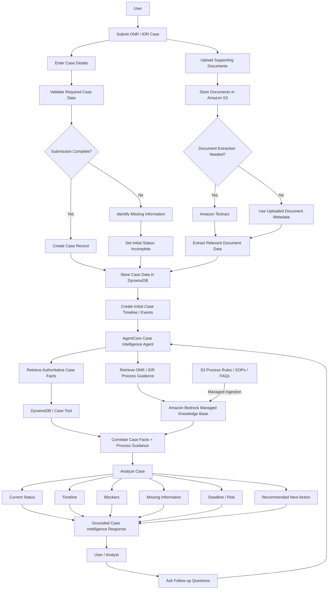
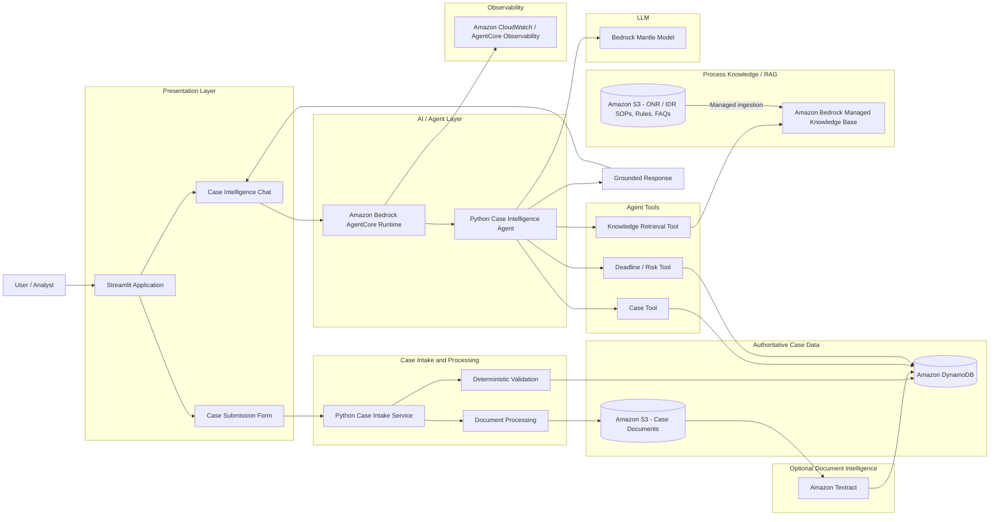

# ONR/IDR Case Intake & Intelligence Agent

## 1. Project Goal

Build an AWS-based capstone application where a user can submit a synthetic ONR/IDR case, upload supporting documents, and then use an AI agent to understand the case.

The application should:

- Accept a new ONR/IDR case submission.
- Validate required case fields and documents.
- Store authoritative case data.
- Store supporting documents.
- Build an initial case timeline.
- Identify missing information and blockers.
- Detect approaching or missed deadlines.
- Recommend the next operational action using ONR/IDR process guidance.
- Allow natural-language Q&A about the case.
- Generate an analyst/supervisor-ready case summary.
- Use only synthetic/mock data for the capstone. Do not use PHI/PII.

## 2. Core Design Principle

Keep official case facts separate from AI reasoning.

- **DynamoDB / Case API** = authoritative case facts and status.
- **Amazon Bedrock Managed Knowledge Base** = retrieval of ONR/IDR SOPs, rules,
  FAQs, process guidance, and their source locations.
- **Bedrock Mantle model** = interpretation, correlation, explanation,
  summarization, and recommendations after retrieval is complete.
- **AgentCore** = the optional deployment and observability boundary after the
  local Python agent works.
- The LLM must never invent official case status, case dates, documents, or events.

## 3. Core Use Cases

1. **Case submission & intake**  
   Allow a user to submit a new ONR/IDR case with case details and supporting documents. Validate required information, store the case, and create the initial case record.

2. **Case status & timeline**  
   Explain the current status and generate a concise chronological case history.

3. **Blocker analysis**  
   Identify why a case is pending, stalled, incomplete, or unable to proceed.

4. **Deadline & risk detection**  
   Flag approaching/missed deadlines and workflow exceptions.

5. **Next-action recommendation**  
   Recommend the next operational step using authoritative case facts and retrieved ONR/IDR process guidance.

6. **Missing information**  
   Identify missing documents, responses, required fields, or required case data.

7. **Natural-language Q&A**  
   Answer questions across case data, event history, documents, and process rules.

8. **Case summary**  
   Create an analyst/supervisor-ready summary of key facts, recent activity, blockers, risks, and recommended actions.

9. **Multi-case insights — Phase 2**  
   Surface aging cases, common blockers, recurring missing information, and priority work queues.

## 4. MVP Scope

Implement only the following initially:

- Submit one synthetic ONR/IDR case.
- Upload zero or more synthetic PDF documents.
- Validate required fields.
- Store case data in DynamoDB.
- Store documents in S3.
- Create an initial event/timeline.
- Ask questions about a single case.
- Generate current-state summary and timeline.
- Identify blockers and missing information.
- Calculate deterministic deadline risk.
- Retrieve ONR/IDR process guidance through a Bedrock Managed Knowledge Base.
- Recommend the next action with evidence.
- Show evidence/citations where possible.

Do not include these in the first MVP:

- EKS
- Kafka
- Step Functions
- Multi-agent architecture
- AgentCore Gateway unless needed later
- Production authentication
- Multi-case analytics
- Complex document pipelines
- Real PHI/PII

## 5. End-to-End Workflow



## 6. AWS Architecture



The Managed Knowledge Base owns embedding-model selection, indexing, scaling, and
vector storage. The Knowledge Retrieval Tool calls `Retrieve` and preserves the
returned passages and source locations. It does not call `RetrieveAndGenerate`.
The agent sends the retrieved evidence to the separate Bedrock Mantle model only
when a generated explanation, summary, or recommendation is required.

## 7. Suggested Repository Structure

```text
onr-idr-agent/
├── README.md
├── requirements.txt
├── .env.example
├── app/
│   ├── __init__.py
│   ├── config.py
│   ├── models/
│   │   ├── case.py
│   │   └── response.py
│   ├── services/
│   │   ├── case_service.py
│   │   ├── document_service.py
│   │   ├── knowledge_service.py
│   │   └── agent_service.py
│   ├── tools/
│   │   ├── case_tool.py
│   │   ├── timeline_tool.py
│   │   ├── missing_info_tool.py
│   │   ├── deadline_risk_tool.py
│   │   └── knowledge_tool.py
│   ├── prompts/
│   │   └── system_prompt.py
│   └── agent.py
├── ui/
│   └── streamlit_app.py
├── data/
│   ├── cases.json
│   └── knowledge/
│       ├── onr_process.md
│       ├── idr_process.md
│       ├── deadline_rules.md
│       └── missing_document_rules.md
├── scripts/
│   ├── seed_dynamodb.py
│   └── upload_knowledge_docs.py
└── tests/
    ├── test_case_service.py
    ├── test_deadline_risk.py
    └── test_agent_grounding.py
```

## 8. Suggested Case Model

Start with a simple case structure.

```json
{
  "case_id": "CASE-1001",
  "case_type": "ONR",
  "status": "PENDING_PROVIDER_RESPONSE",
  "created_date": "2026-08-01",
  "open_negotiation_start_date": "2026-08-02",
  "open_negotiation_end_date": "2026-08-31",
  "provider_name": "Synthetic Provider A",
  "provider_response_received": false,
  "missing_documents": [],
  "documents": [
    {
      "document_id": "DOC-001",
      "file_name": "negotiation_notice.pdf",
      "s3_key": "CASE-1001/negotiation_notice.pdf"
    }
  ],
  "events": [
    {
      "date": "2026-08-01",
      "type": "CASE_CREATED",
      "description": "ONR case created"
    },
    {
      "date": "2026-08-02",
      "type": "NOTICE_SENT",
      "description": "Open negotiation notice sent"
    }
  ]
}
```

## 9. Initial Synthetic Test Scenarios

Create at least five synthetic cases.

- **CASE-1001** — pending provider response.
- **CASE-1002** — missing required document.
- **CASE-1003** — deadline approaching.
- **CASE-1004** — deadline missed.
- **CASE-1005** — complete/normal case.

These cases should be deterministic so the expected answer is known before involving the LLM.

## 10. Initial Agent Tools

Implement the following tools one at a time.

### `get_case(case_id)`

Purpose: Retrieve authoritative case facts.

Source of truth:

- Initially: local JSON.
- Later: DynamoDB.

### `get_case_timeline(case_id)`

Purpose: Sort and return case events chronologically.

### `get_missing_information(case_id)`

Purpose: Identify required fields/documents/responses that are absent.

This should primarily use deterministic rules.

### `calculate_deadline_risk(case_id)`

Purpose: Calculate deadline status in Python rather than asking the LLM to calculate dates.

Example result:

```json
{
  "deadline": "2026-08-31",
  "days_remaining": 5,
  "risk": "MEDIUM"
}
```

Suggested risk model for the capstone:

- `MISSED`: deadline already passed.
- `HIGH`: 0-3 days remaining.
- `MEDIUM`: 4-7 days remaining.
- `LOW`: more than 7 days remaining.

### `search_process_knowledge(question)`

Purpose: Call the Bedrock Managed Knowledge Base `Retrieve` API and return relevant
ONR/IDR SOP/rule/FAQ passages, source identifiers, and document locations.

Do not use this tool as the source of official case facts, and do not generate an
answer inside the tool.

## 11. Agent Behavior

The agent should follow these rules:

1. Retrieve case facts before answering a case-specific question.
2. Treat case data returned by the Case Tool as authoritative.
3. Never invent case status, dates, documents, events, or responses.
4. Use deterministic tools for missing information and deadline calculations.
5. Retrieve process guidance when explaining why something is blocked or what should happen next.
6. Preserve the passages and source locations returned by retrieval.
7. Send grounded context to the Bedrock Mantle model only after required retrieval completes.
8. Distinguish facts from recommendations.
9. If required evidence cannot be retrieved, say that it is unavailable.
10. Prefer concise operational answers.

Suggested response format:

```text
Case: CASE-1001

Current Status
...

Timeline
...

Blocker
...

Missing Information
...

Deadline Risk
...

Recommended Next Action
...

Evidence
...
```

## 12. Streamlit MVP

Build two primary views.

### View 1 — Submit Case

Fields:

- Case type: ONR / IDR.
- Case reference or generated case ID.
- Provider name.
- Relevant start/end dates.
- Supporting documents.
- Additional notes.

On submission:

1. Validate required fields.
2. Generate a case ID if needed.
3. Upload documents to S3.
4. Store case record in DynamoDB.
5. Create `CASE_CREATED` event.
6. Determine the initial deterministic status.
7. Display confirmation.

### View 2 — Case Intelligence

Fields:

- Case ID.
- Question.

Example questions:

- What is the current status?
- Why is this case pending?
- What information is missing?
- Is there a deadline risk?
- What should the analyst do next?
- Give me the case timeline.
- Summarize this case for a supervisor.

## 13. Development Order for Codex

Follow this sequence. Do not jump ahead unless the current step is working.

### Phase A — Local deterministic application

1. Create repository/folder structure.
2. Create Pydantic case models.
3. Create five synthetic cases in JSON.
4. Implement `get_case()`.
5. Implement `get_case_timeline()`.
6. Implement `get_missing_information()`.
7. Implement `calculate_deadline_risk()`.
8. Add unit tests.

### Phase B — Local AI agent

9. Add a Bedrock Mantle model client.
10. Create the system prompt.
11. Expose the deterministic functions as agent tools.
12. Test case Q&A locally.
13. Verify the model does not invent official status.

### Phase C — AWS data layer

14. Create DynamoDB table.
15. Move synthetic case records from JSON to DynamoDB.
16. Create S3 bucket for case documents.
17. Implement document upload.
18. Keep Textract disabled initially unless needed.

### Phase D — RAG

19. Write 3-5 synthetic ONR/IDR process documents.
20. Upload them to an S3 knowledge bucket/prefix.
21. Create a Bedrock Managed Knowledge Base with managed embeddings, its S3 data
    source, and least-privilege IAM roles. Do not create a separate vector store or
    configure an embedding-model ARN.
22. Sync documents.
23. Implement `search_process_knowledge()` with `Retrieve`, returning passages and
    source locations rather than a generated answer.
24. Give the agent access to the Knowledge Tool and keep response generation in
    the separate Bedrock Mantle client.
25. Test grounded next-action recommendations.

### Phase E — UI

26. Build Streamlit case-submission form.
27. Build Streamlit case-intelligence chat.
28. Show status, timeline, blocker, risk, missing information, recommendation, and evidence.

### Phase F — AgentCore

29. Make the working Python agent AgentCore-compatible.
30. Test it locally using AgentCore tooling.
31. Grant the runtime least-privilege access to Knowledge Base retrieval and
    Bedrock Mantle inference.
32. Deploy to AgentCore Runtime.
33. Update Streamlit to invoke the deployed agent.
34. Add CloudWatch/AgentCore observability.

### Phase G — Optional improvements

35. Add one Textract-backed PDF use case.
36. Add evaluation dataset/tests.
37. Add Phase 2 multi-case insights only after the MVP is stable.

## 14. First Codex Task

Use this as the first prompt to Codex in VS Code:

```text
Read this markdown file as the implementation specification for the project.

Start with Phase A only.

Create the initial Python project structure and implement:
1. Pydantic models for an ONR/IDR case and case event.
2. data/cases.json containing five synthetic cases covering:
   - pending provider response
   - missing document
   - deadline approaching
   - deadline missed
   - complete case
3. app/services/case_service.py with get_case(case_id).
4. app/tools/timeline_tool.py.
5. app/tools/missing_info_tool.py.
6. app/tools/deadline_risk_tool.py.
7. pytest tests for all deterministic functions.
8. requirements.txt.

Do not add Streamlit, DynamoDB, S3, Bedrock, RAG, AgentCore, or Textract yet.

Keep business rules simple, explicit, and deterministic.
After implementation, show me the created files and the command to run the tests.
```

## 15. Definition of Done for Phase A

Phase A is complete when:

- `pytest` passes.
- All five synthetic cases can be loaded by case ID.
- Timeline events are returned chronologically.
- Missing information is deterministic.
- Deadline risk is deterministic.
- No AWS credentials are required.
- No LLM is required.

Do not continue to AWS until this foundation works.

## 16. MVP Success Criteria

The final demo should reliably demonstrate this scenario:

1. User submits a synthetic ONR/IDR case.
2. System creates the authoritative case record.
3. User opens the newly created case.
4. Agent retrieves authoritative case facts.
5. Agent retrieves relevant ONR/IDR process guidance.
6. System identifies at least one meaningful blocker/risk scenario.
7. The Bedrock Mantle model recommends an actionable next step from grounded context.
8. Response includes citations from Knowledge Base retrieval.
9. Agent does not hallucinate official case status.
