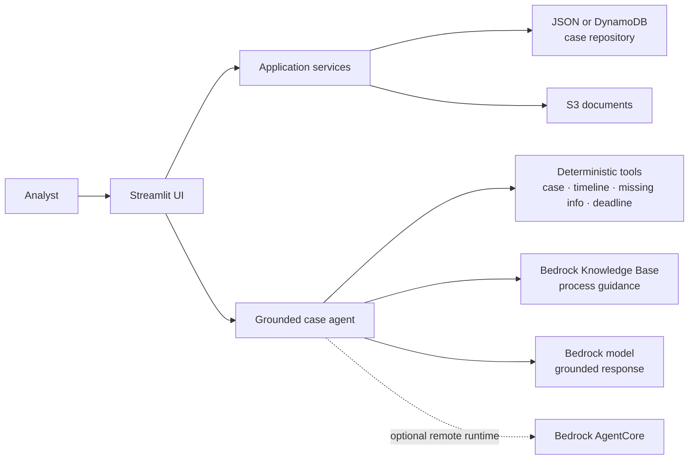

# ONR / IDR Case Intelligence Agent

> A grounded AI assistant for reviewing Open Negotiation (ONR) and Independent
> Dispute Resolution (IDR) cases without blurring authoritative facts,
> deterministic calculations, and model-generated guidance.

## The project in one minute

| | |
| --- | --- |
| **Problem** | Case analysts must assemble records, timelines, documents, deadlines, and process guidance from several sources. |
| **Solution** | One Streamlit workspace that supports case intake, document upload, case review, grounded summaries, and case-aware chat. |
| **Trust model** | Case facts come from the configured repository, deadlines and missing items come from deterministic tools, and general guidance is retrieved and cited separately. |
| **Deployment path** | Run locally with sample JSON data, connect to AWS services for a cloud-backed demo, or deploy the agent through Amazon Bedrock AgentCore Runtime. |

This repository is a demonstration and development project. Its bundled cases,
documents, and organizations are synthetic and contain no PHI or PII. It is not
legal advice or a production claims-processing system.

## What the demo shows

1. **Find or create a case** — use bundled JSON data locally or DynamoDB in AWS.
2. **Review the evidence** — inspect status, dates, timeline events, missing
   information, and supporting documents.
3. **Calculate risk consistently** — deterministic code evaluates deadline risk;
   the language model does not invent the result.
4. **Generate a grounded summary** — Amazon Bedrock receives an explicit set of
   authoritative case facts.
5. **Ask what happens next** — the agent retrieves relevant process guidance,
   returns citations, and keeps that guidance separate from official case facts.

## How it works



The key design choice is the trust boundary:

- **Authoritative facts** are read from the case repository.
- **Computed results** are produced by testable Python tools.
- **Process guidance** is retrieved from the knowledge base and cited.
- **Generated text** is validated against supplied evidence before it is returned.

## Quick start: local presentation

### Prerequisites

- Python 3.12
- PowerShell (commands below) or an equivalent shell

### Run the app

```powershell
python -m venv .venv
.\.venv\Scripts\Activate.ps1
python -m pip install -r requirements.txt
streamlit run streamlit_app.py
```

The default configuration uses `data/cases.json`, so AWS credentials are not
required to open the interface and explore deterministic case workflows. Start
with case `CASE-1001`.

AI summaries and chat require the relevant Bedrock configuration. The complete
cloud-backed walkthrough is in [STEP_14_STREAMLIT.md](STEP_14_STREAMLIT.md), and
the scripted demo story is in [STEP_14_DEMO.md](STEP_14_DEMO.md).

### Run the tests

```powershell
python -m pip install -r requirements-dev.txt
python -m pytest
```

Normal test runs exclude tests that call live AWS resources. Integration tests
are deliberately opt-in so local verification does not create cloud activity or
cost unexpectedly.

## Configuration at a glance

| Variable | Purpose | Local default |
| --- | --- | --- |
| `CASE_REPOSITORY` | Selects `json` or `dynamodb` case storage | `json` |
| `JSON_CASES_PATH` | Local case data file | `data/cases.json` |
| `AWS_REGION` | AWS region used by adapters | `us-east-1` |
| `DYNAMODB_CASE_TABLE` | Cloud case table | Required for DynamoDB mode |
| `S3_CASE_DOCUMENTS_BUCKET` | Supporting-document bucket | Optional |
| `BEDROCK_MODEL_ID` | Model used for summaries and agent responses | Optional |
| `BEDROCK_KNOWLEDGE_BASE_ID` | Retrieval source for process guidance | Optional |
| `AGENTCORE_RUNTIME_ARN` | Remote AgentCore runtime | Optional |
| `AGENTCORE_ENDPOINT_NAME` | Stable AgentCore endpoint | Optional |

Use environment variables for runtime configuration. Do not commit AWS
credentials, Terraform state, local `.tfvars`, or generated deployment packages;
the repository ignore rules exclude these artifacts.

## Project map

| Path | Responsibility |
| --- | --- |
| `app/models/` | Typed case, document, timeline, and status models |
| `app/repositories/` | JSON, DynamoDB, and S3 persistence adapters |
| `app/services/` | Case workflows, summaries, and grounded-agent orchestration |
| `app/tools/` | Deterministic case, timeline, missing-information, deadline, and retrieval tools |
| `app/language_models/` | Bedrock and Bedrock Mantle model adapters |
| `app/ui.py` | Streamlit presentation layer |
| `agentcore_main.py` | Bedrock AgentCore Runtime entry point |
| `data/knowledge/` | Curated demonstration guidance used for retrieval |
| `infra/` | Terraform for the AWS development environment |
| `tests/` | Unit, grounding-evaluation, and opt-in integration tests |

## Suggested demo path

For a short presentation:

1. Open **Case lookup** and load `CASE-1001`.
2. Point out the authoritative status, timeline, missing information, and
   deterministic deadline result.
3. Open **Case summary** to show a fact-limited generated summary.
4. Open **Case chat** and ask: _“What should the analyst do next, and what
   process guidance supports that action?”_
5. Show that general guidance has citations and is displayed separately from
   official case evidence.

For the full synthetic workflow—including submitting a new case and uploading
two generated PDFs—follow [STEP_14_DEMO.md](STEP_14_DEMO.md).

## Deeper documentation

- [Component reference](COMPONENT_REFERENCE.md) — architecture and code map
- [AWS development](AWS_DEVELOPMENT.md) — cloud prerequisites and safety boundary
- [Bedrock development](BEDROCK_DEVELOPMENT.md) — model configuration
- [Knowledge Base development](KNOWLEDGE_BASE_DEVELOPMENT.md) — retrieval setup
- [Grounding evaluations](GROUNDING_EVALUATIONS.md) — evidence-safety checks
- [AgentCore deployment](STEP_15_AGENTCORE.md) — packaging, deployment, and observability

## Safety notes

- Keep all demo data synthetic; do not add PHI, PII, or real claim material.
- Review every Terraform plan before apply. Cloud deployment creates billable
  resources, and the development buckets support destructive cleanup.
- Treat model output as assistive. The application is designed to expose its
  evidence and limitations, not to replace analyst review.
