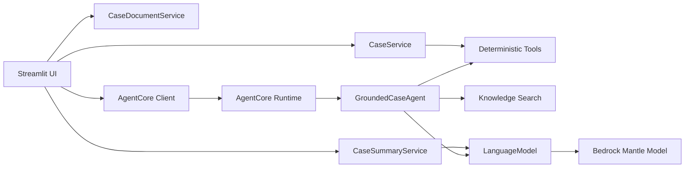
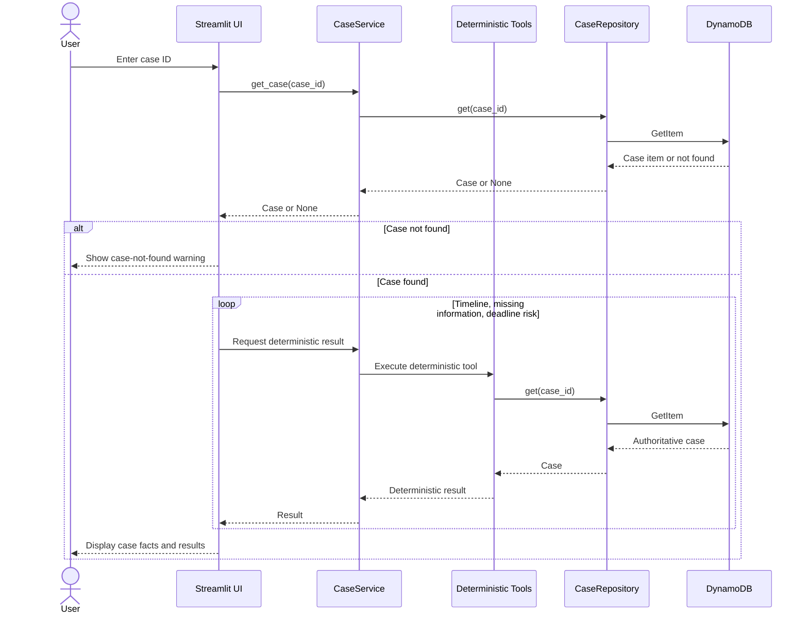
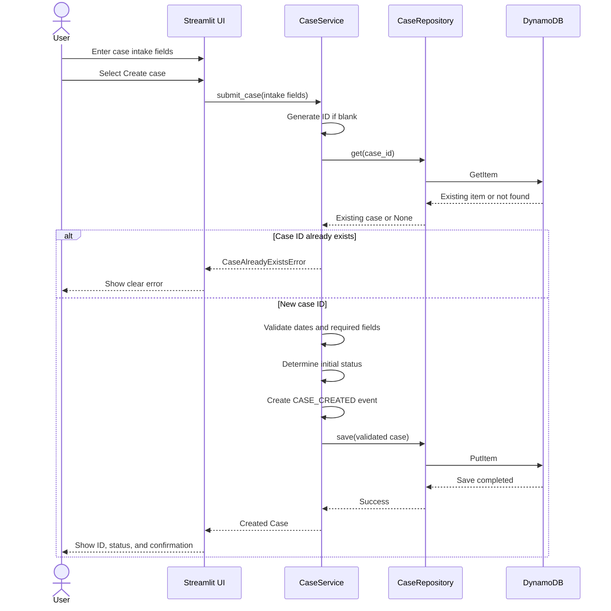
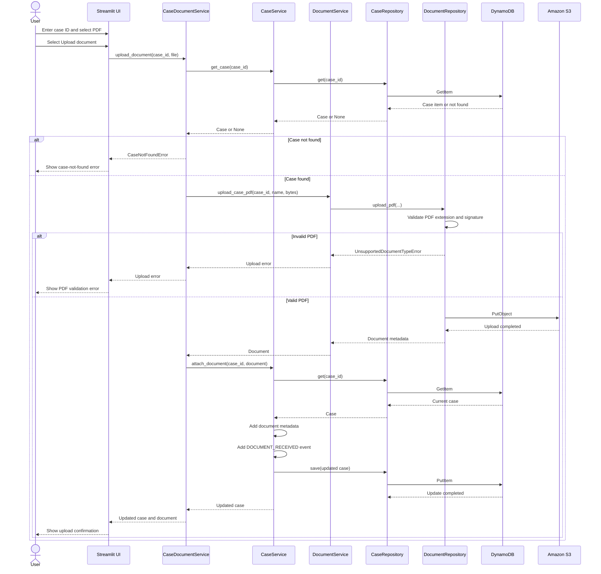
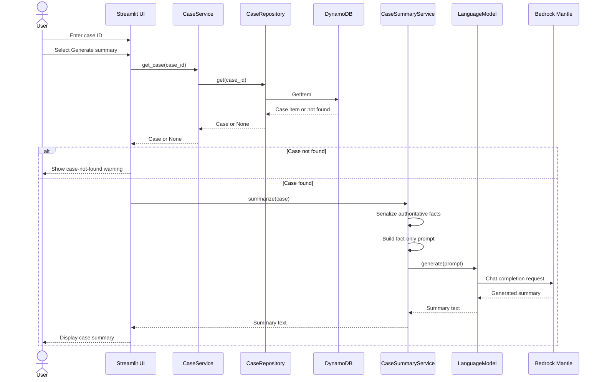
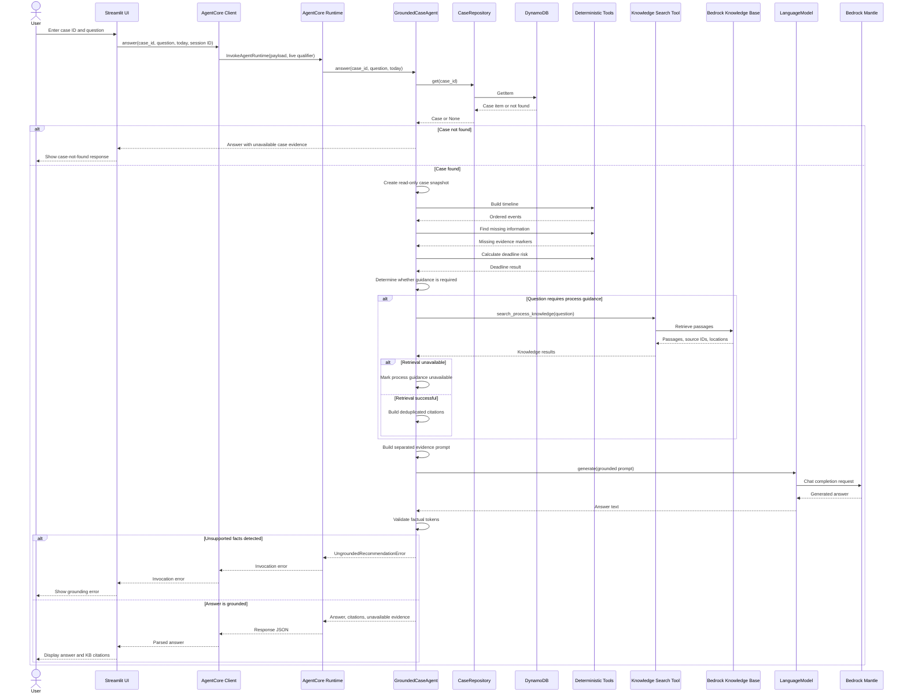

# Step 14 Sequence Diagrams

These diagrams describe the implemented Streamlit workflows. Streamlit calls
local application services for the first four workflows and invokes the
deployed AgentCore endpoint for Case chat. AWS adapters remain behind those
boundaries.

## LLM boundary

Only case summary and case chat generate text with the configured language
model. Knowledge Base retrieval returns passages and citations but does not
generate the final answer.

## 1. Case lookup and deterministic results

## 2. Case submission

## 3. Document upload

## 4. Case summary

## 5. Case chat with Knowledge Base citations

