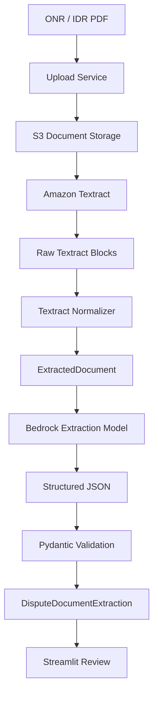

# STEP 16A — ONR / IDR PDF Extraction

## Goal

Implement the first document-intelligence stage of the **ONR / IDR Case Intelligence Agent**:

```text
ONR / IDR PDF
      |
      v
Document Upload
      |
      v
Amazon Textract
      |
      v
Normalized Textract Output
      |
      v
Amazon Bedrock LLM
      |
      v
Structured ONR / IDR JSON
      |
      v
Pydantic Validation
      |
      v
Ready for Claim Validation
```

This step focuses only on **extracting and structuring document content**.

Do **not** implement claim validation, NSA eligibility, ONR → IDR linking, or adjudication logic yet.

The output of this step will become the input to later steps.

---

## 1. Design principle

Use:

> **Textract for document structure and OCR. Bedrock for semantic interpretation. Pydantic for deterministic validation.**

Do not trust the LLM as the source of truth for claim validity.

The LLM may:

- classify the document as ONR or IDR;
- identify semantic fields;
- normalize labels;
- normalize dates;
- normalize currency values;
- identify which extracted text represents claim number, QPA, payment, provider offer, etc.;
- summarize the document.

The LLM must not:

- verify that a claim exists;
- determine legal eligibility;
- invent missing values;
- infer payer claim validity;
- create a Federal IDR reference that is not present;
- silently replace uncertain OCR values.

---

## 2. Target architecture



For local development, also support:

```text
Local PDF
   |
   v
Upload / mock extraction path
```

The application should continue to run without AWS credentials when possible.

---

## 3. Recommended repository changes

Add:

```text
app/
  models/
    document_extraction.py

  repositories/
    document_repository.py
    local_document_repository.py
    s3_document_repository.py

  services/
    document_extraction_service.py
    textract_service.py
    textract_normalizer.py
    bedrock_extraction_service.py

  tools/
    document_classifier_tool.py
    extraction_validation_tool.py

  prompts/
    dispute_document_extraction_prompt.py

data/
  sample_documents/
    README.md

tests/
  fixtures/
    onr_textract_response.json
    idr_textract_response.json
    onr_bedrock_response.json
    idr_bedrock_response.json

  test_document_extraction_models.py
  test_textract_normalizer.py
  test_bedrock_extraction_service.py
  test_document_extraction_service.py
```

Modify:

```text
app/config.py
app/services/factory.py
app/ui.py
README.md
COMPONENT_REFERENCE.md
```

Optional later:

```text
infra/
  modules/
    s3_documents/
    textract_permissions/
```

---

## 4. Supported extraction modes

Support three logical modes:

```text
TEXTRACT
BEDROCK
HYBRID
```

Recommended default:

```text
HYBRID
```

Configuration:

```text
DOCUMENT_EXTRACTION_MODE=hybrid
```

### Mode A — Textract only

```text
PDF
 |
 v
Textract
 |
 v
Forms / Tables / Text
 |
 v
Rule-based mapping
 |
 v
Structured fields
```

Purpose:

- baseline;
- debugging;
- confidence inspection;
- comparison against LLM results.

### Mode B — Bedrock only

```text
PDF
 |
 v
Bedrock document understanding
 |
 v
Structured JSON
```

Purpose:

- experimentation;
- comparison;
- fallback.

Do not make this the default production-style architecture.

### Mode C — Hybrid

Recommended:

```text
PDF
 |
 v
Textract
 |
 v
Normalized extracted text
 |
 v
Bedrock semantic extraction
 |
 v
Pydantic
 |
 v
Canonical JSON
```

This is the primary implementation for the capstone.

---

## 5. Canonical document model

Create:

```text
app/models/document_extraction.py
```

Start with:

```python
from datetime import date
from decimal import Decimal
from enum import StrEnum

from pydantic import BaseModel, ConfigDict, Field


class DisputeDocumentType(StrEnum):
    ONR = "ONR"
    IDR = "IDR"
    UNKNOWN = "UNKNOWN"


class ExtractionSource(StrEnum):
    TEXTRACT = "TEXTRACT"
    BEDROCK = "BEDROCK"
    HYBRID = "HYBRID"
```

---

## 6. Field evidence model

Every important extracted field should retain evidence.

```python
class FieldEvidence(BaseModel):
    model_config = ConfigDict(extra="forbid")

    value: str | None = None
    source: ExtractionSource
    page: int | None = Field(default=None, ge=1)
    confidence: float | None = Field(default=None, ge=0, le=100)
    raw_text: str | None = None
```

Example:

```json
{
  "value": "CLM-987654321",
  "source": "TEXTRACT",
  "page": 2,
  "confidence": 98.7,
  "raw_text": "Claim Number: CLM-987654321"
}
```

This evidence is important for:

- auditability;
- analyst review;
- debugging;
- low-confidence detection;
- later AI explanations.

---

## 7. Normalized dispute document model

```python
class ExtractedDisputeDocument(BaseModel):
    model_config = ConfigDict(
        extra="forbid",
        validate_assignment=True,
    )

    document_type: DisputeDocumentType
    source_file_name: str

    claim_number: str | None = None
    provider_claim_number: str | None = None
    member_id: str | None = None

    provider_name: str | None = None
    provider_npi: str | None = None
    provider_tin: str | None = None

    date_of_service: date | None = None
    cpt_hcpcs: list[str] = []

    billed_amount: Decimal | None = None
    initial_payment: Decimal | None = None
    qpa: Decimal | None = None
    requested_amount: Decimal | None = None

    open_negotiation_start_date: date | None = None
    open_negotiation_end_date: date | None = None

    federal_idr_reference: str | None = None
    initiating_party: str | None = None
    extraction_summary: str | None = None
```

This model contains normalized values. Field-level evidence is stored separately.

---

## 8. Extraction result model

```python
class DisputeDocumentExtraction(BaseModel):
    document: ExtractedDisputeDocument
    field_evidence: dict[str, FieldEvidence]
    missing_fields: list[str] = []
    warnings: list[str] = []
    extraction_mode: ExtractionSource
    raw_textract_text: str | None = None
```

Example:

```json
{
  "document": {
    "document_type": "ONR",
    "source_file_name": "onr_case_001.pdf",
    "claim_number": "CLM-987654321",
    "member_id": "SYN-MBR-1001",
    "provider_name": "Synthetic Emergency Physicians",
    "provider_npi": "1234567890",
    "date_of_service": "2026-07-10",
    "cpt_hcpcs": ["99285"],
    "billed_amount": "8500.00",
    "initial_payment": "2100.00",
    "qpa": "1950.00",
    "requested_amount": "6000.00",
    "open_negotiation_start_date": "2026-07-15",
    "open_negotiation_end_date": null,
    "federal_idr_reference": null,
    "initiating_party": "PROVIDER",
    "extraction_summary": "Synthetic ONR request for an emergency service claim."
  },
  "field_evidence": {},
  "missing_fields": [],
  "warnings": [],
  "extraction_mode": "HYBRID"
}
```

---

## 9. Document repository

Create:

```text
app/repositories/document_repository.py
```

```python
from typing import Protocol


class StoredDocument:
    def __init__(
        self,
        document_id: str,
        file_name: str,
        location: str,
    ):
        self.document_id = document_id
        self.file_name = file_name
        self.location = location


class DocumentRepository(Protocol):
    def save(
        self,
        *,
        file_name: str,
        content: bytes,
    ) -> StoredDocument:
        ...
```

Provide:

```text
LocalDocumentRepository
S3DocumentRepository
```

---

## 10. Local document repository

Create:

```text
app/repositories/local_document_repository.py
```

Suggested location:

```text
data/uploads/
```

Implementation goals:

- generate a safe internal document ID;
- sanitize the file name;
- save bytes;
- reject unsupported extensions;
- return the stored location.

Allow only:

```text
.pdf
```

for this first step.

Do not allow arbitrary local paths from the user.

---

## 11. S3 document repository

Create:

```text
app/repositories/s3_document_repository.py
```

Suggested object key:

```text
uploads/{document_id}/{file_name}
```

Example:

```text
uploads/DOC-9f8635/onr_case_001.pdf
```

Do not use member name, patient name, NPI, or claim number in the S3 object path.

For the capstone, use synthetic files only.

---

## 12. Textract service

Create:

```text
app/services/textract_service.py
```

Define:

```python
class TextractExtractionResult(BaseModel):
    job_id: str | None = None
    full_text: str
    pages: list["TextractPage"]
    key_values: list["TextractKeyValue"]
    tables: list["TextractTable"]
    queries: list["TextractQueryResult"]
```

---

## 13. Multi-page PDF Textract flow

For ONR / IDR PDFs stored in S3, use asynchronous document analysis.

Conceptual boto3 flow:

```python
import boto3

textract = boto3.client("textract")

response = textract.start_document_analysis(
    DocumentLocation={
        "S3Object": {
            "Bucket": bucket,
            "Name": key,
        }
    },
    FeatureTypes=[
        "FORMS",
        "TABLES",
        "LAYOUT",
    ],
)

job_id = response["JobId"]
```

Then retrieve:

```python
response = textract.get_document_analysis(
    JobId=job_id
)
```

Handle:

```text
NextToken
```

until all blocks are returned.

---

## 14. Keep Textract orchestration out of the UI

Keep AWS polling inside:

```text
TextractService
```

not inside:

```text
Streamlit UI
```

Suggested API:

```python
class TextractService:

    def analyze_pdf(
        self,
        *,
        bucket: str,
        key: str,
    ) -> TextractExtractionResult:
        ...
```

For Step 16A, synchronous polling inside this service is acceptable for a demo.

Later, it can become:

```text
S3
 |
 v
EventBridge / Lambda
 |
 v
Textract async
 |
 v
SNS / SQS
 |
 v
processing worker
```

Do not add that infrastructure in the first implementation.

---

## 15. Textract normalizer

Textract returns a large block graph.

Do not send the complete raw response directly to the LLM.

Create:

```text
app/services/textract_normalizer.py
```

Input:

```text
Textract Blocks
```

Output:

```text
clean text
key/value pairs
tables
page numbers
confidence
```

Example normalized form:

```json
{
  "pages": [
    {
      "page": 1,
      "text": "OPEN NEGOTIATION NOTICE ...",
      "key_values": [
        {
          "key": "Claim Number",
          "value": "CLM-987654321",
          "confidence": 98.7
        },
        {
          "key": "Provider NPI",
          "value": "1234567890",
          "confidence": 99.1
        }
      ]
    }
  ]
}
```

---

## 16. Recommended Textract normalized classes

```python
class TextractKeyValue(BaseModel):
    key: str
    value: str
    page: int
    confidence: float | None = None


class TextractLine(BaseModel):
    text: str
    page: int
    confidence: float | None = None


class TextractPage(BaseModel):
    page: int
    lines: list[TextractLine]
    key_values: list[TextractKeyValue]
```

Keep table support simple initially.

---

## 17. Textract Queries — optional Phase 2

After generic extraction works, add Textract Queries.

Possible questions:

```text
What is the claim number?
What is the provider NPI?
What is the date of service?
What is the qualifying payment amount?
What is the initial payment amount?
What is the provider requested amount?
What is the Federal IDR reference number?
```

Queries should supplement, not replace, normal extraction.

Store:

```text
query
answer
confidence
page
```

Then compare query answers with the Bedrock result.

---

## 18. Bedrock extraction service

Create:

```text
app/services/bedrock_extraction_service.py
```

Suggested interface:

```python
class BedrockExtractionService:

    def extract_dispute_fields(
        self,
        *,
        file_name: str,
        textract_text: str,
        key_values: list[TextractKeyValue],
    ) -> ExtractedDisputeDocument:
        ...
```

For the Hybrid flow, send:

```text
document file name
normalized text
normalized key/value pairs
target schema
strict extraction instructions
```

Do not send unnecessary Textract geometry unless needed.

---

## 19. Bedrock extraction prompt

Create:

```text
app/prompts/dispute_document_extraction_prompt.py
```

Recommended system instructions:

```text
You extract structured data from ONR and IDR healthcare dispute documents.

The input is OCR text and key/value data produced by Amazon Textract.

Rules:

1. Extract only values supported by the provided document evidence.
2. Do not invent missing values.
3. If a value is uncertain or absent, return null.
4. Classify the document as ONR, IDR, or UNKNOWN.
5. Do not determine whether a claim is valid.
6. Do not determine legal eligibility.
7. Do not calculate deadlines.
8. Do not infer a Federal IDR reference unless explicitly present.
9. Normalize dates to YYYY-MM-DD.
10. Normalize currency values as decimal numbers.
11. Preserve identifiers exactly except for surrounding whitespace.
12. CPT/HCPCS values must be returned as strings.
13. Return JSON only.
```

---

## 20. Prompt input

Example user prompt:

```text
SOURCE FILE:
onr_case_001.pdf

TARGET JSON SCHEMA:

{
  "document_type": "ONR | IDR | UNKNOWN",
  "claim_number": "string | null",
  "provider_claim_number": "string | null",
  "member_id": "string | null",
  "provider_name": "string | null",
  "provider_npi": "string | null",
  "provider_tin": "string | null",
  "date_of_service": "YYYY-MM-DD | null",
  "cpt_hcpcs": ["string"],
  "billed_amount": "decimal | null",
  "initial_payment": "decimal | null",
  "qpa": "decimal | null",
  "requested_amount": "decimal | null",
  "open_negotiation_start_date": "YYYY-MM-DD | null",
  "open_negotiation_end_date": "YYYY-MM-DD | null",
  "federal_idr_reference": "string | null",
  "initiating_party": "string | null",
  "extraction_summary": "string | null"
}

TEXTRACT KEY/VALUE PAIRS:

Claim Number: CLM-987654321
Provider: Synthetic Emergency Physicians
Provider NPI: 1234567890
Date of Service: July 10, 2026
QPA: $1,950.00
Initial Payment: $2,100.00
Requested Amount: $6,000.00

OCR TEXT:

<normalized Textract text>
```

---

## 21. Pydantic validation

Never directly return:

```python
json.loads(model_response)
```

to the rest of the application.

Instead:

```python
data = json.loads(model_response)

document = ExtractedDisputeDocument.model_validate(
    data
)
```

If validation fails, raise or return:

```text
ExtractionValidationError
```

Do not silently coerce malformed LLM output.

---

## 22. ONR vs IDR classification

The LLM may classify:

```text
ONR
IDR
UNKNOWN
```

Add a deterministic helper too.

Create:

```text
app/tools/document_classifier_tool.py
```

Simple high-confidence signals:

ONR:

```text
Open Negotiation
Open Negotiation Notice
30-business-day negotiation
```

IDR:

```text
Independent Dispute Resolution
Federal IDR
Certified IDR Entity
IDR initiation
IDR reference
```

Recommended result:

```python
class DocumentClassificationResult(BaseModel):
    deterministic_type: DisputeDocumentType
    llm_type: DisputeDocumentType
    final_type: DisputeDocumentType
    warnings: list[str]
```

If:

```text
deterministic = ONR
LLM = IDR
```

return `UNKNOWN` or flag it for analyst review.

Do not silently choose one.

---

## 23. Field evidence mapping

After Bedrock returns normalized JSON, create evidence for each field.

Example:

```text
claim_number = CLM-987654321
```

Find the strongest supporting Textract key/value or line.

Store:

```json
{
  "claim_number": {
    "value": "CLM-987654321",
    "source": "HYBRID",
    "page": 2,
    "confidence": 98.7,
    "raw_text": "Claim Number: CLM-987654321"
  }
}
```

If the LLM produced a value but no supporting OCR text can be found:

```text
warning:
No direct Textract evidence found for requested_amount.
```

Do not mark it high confidence.

---

## 24. Confidence policy

Keep the first version simple.

Example thresholds:

```python
HIGH_CONFIDENCE = 90.0
REVIEW_CONFIDENCE = 75.0
```

Interpretation:

```text
>= 90     HIGH
75 - 89   REVIEW
< 75      LOW
```

Do not automatically accept or reject a case based on these thresholds.

Use them only for analyst review.

---

## 25. Hybrid extraction strategy

Recommended first implementation:

```text
1. Run Textract.
2. Normalize Textract output.
3. Send normalized content to Bedrock.
4. Parse Bedrock JSON.
5. Validate using Pydantic.
6. Match returned values back to Textract evidence.
7. Produce DisputeDocumentExtraction.
```

Later enhancement:

```text
If Textract confidence is high:
    use Textract candidate

If Textract is missing / ambiguous:
    ask Bedrock

If Bedrock value has no evidence:
    flag for review
```

Do not implement complex confidence arbitration in the first version.

---

## 26. DocumentExtractionService

Create:

```text
app/services/document_extraction_service.py
```

Suggested interface:

```python
class DocumentExtractionService:

    def __init__(
        self,
        document_repository: DocumentRepository,
        textract_service: TextractService,
        bedrock_service: BedrockExtractionService,
    ):
        ...

    def extract(
        self,
        *,
        file_name: str,
        content: bytes,
    ) -> DisputeDocumentExtraction:
        ...
```

Hybrid flow:

```python
def extract(
    self,
    *,
    file_name: str,
    content: bytes,
) -> DisputeDocumentExtraction:

    stored = self._document_repository.save(
        file_name=file_name,
        content=content,
    )

    textract_result = self._textract_service.analyze(
        stored
    )

    normalized = normalize_textract(
        textract_result
    )

    extracted = self._bedrock_service.extract_dispute_fields(
        file_name=file_name,
        textract_text=normalized.full_text,
        key_values=normalized.key_values,
    )

    evidence = build_field_evidence(
        extracted,
        normalized,
    )

    return DisputeDocumentExtraction(
        document=extracted,
        field_evidence=evidence,
        missing_fields=find_missing_fields(extracted),
        warnings=[],
        extraction_mode=ExtractionSource.HYBRID,
        raw_textract_text=normalized.full_text,
    )
```

---

## 27. Configuration

Add:

```text
DOCUMENT_REPOSITORY=local
DOCUMENT_EXTRACTION_MODE=hybrid
LOCAL_DOCUMENT_PATH=data/uploads
DOCUMENT_S3_BUCKET=
TEXTRACT_REGION=us-east-1
BEDROCK_REGION=us-east-1
BEDROCK_EXTRACTION_MODEL_ID=
```

Recommended local default:

```text
DOCUMENT_REPOSITORY=local
```

For Hybrid AWS extraction:

```text
DOCUMENT_REPOSITORY=s3
DOCUMENT_EXTRACTION_MODE=hybrid
```

---

## 28. Service factory

Update:

```text
app/services/factory.py
```

Build:

```text
DocumentRepository
TextractService
BedrockExtractionService
DocumentExtractionService
```

based on configuration.

Keep AWS client creation outside Streamlit code.

---

## 29. Streamlit page

Add:

```text
Document Extraction
```

Suggested UI:

```text
-------------------------------------------------
ONR / IDR Document Extraction
-------------------------------------------------

Upload PDF:
[ Choose File ]

Extraction Mode:
[ Hybrid ]

[ Extract Document ]
```

Then show:

```text
-------------------------------------------------
Document Classification
-------------------------------------------------

Type:
ONR

-------------------------------------------------
Extracted Fields
-------------------------------------------------

Claim Number        CLM-987654321
Provider            Synthetic Emergency Physicians
NPI                 1234567890
Date of Service     07/10/2026
CPT                 99285
Billed Amount       $8,500
Initial Payment     $2,100
QPA                 $1,950
Requested Amount    $6,000

-------------------------------------------------
Evidence
-------------------------------------------------

Claim Number
Page:               2
Confidence:         98.7%
Raw Text:
Claim Number: CLM-987654321
```

---

## 30. Streamlit debug view

Add an expander:

```text
View Textract Output
```

Show:

```text
Raw OCR text
Key/value pairs
Tables
Page numbers
Confidence
```

Add another:

```text
View Structured JSON
```

Display:

```python
st.json(
    extraction.model_dump(
        mode="json"
    )
)
```

This is useful for a portfolio demo.

---

## 31. Analyst review design

Do not immediately persist extracted values as authoritative case data.

First present:

```text
Extracted Document
```

with:

```text
Accept
Edit
Reject
```

You do not need to implement full editing in Step 16A.

At minimum add:

```text
Extraction Status:
EXTRACTED
REVIEW_REQUIRED
ACCEPTED
REJECTED
```

---

## 32. Extraction status model

```python
class ExtractionStatus(StrEnum):
    EXTRACTED = "EXTRACTED"
    REVIEW_REQUIRED = "REVIEW_REQUIRED"
    ACCEPTED = "ACCEPTED"
    REJECTED = "REJECTED"
```

A later step can connect:

```text
ACCEPTED extraction
        |
        v
Claim Validation
```

---

## 33. Missing fields

Add deterministic missing-field rules.

Common useful fields:

```text
claim_number
provider_npi
date_of_service
cpt_hcpcs
```

For ONR:

```text
requested_amount
open_negotiation_start_date
```

For IDR:

```text
federal_idr_reference
```

Do not make every field mandatory because real documents vary.

Example:

```python
def find_missing_fields(
    document: ExtractedDisputeDocument,
) -> list[str]:
    ...
```

---

## 34. ONR extraction example

Input:

```text
OPEN NEGOTIATION NOTICE

Claim Number:
CLM-987654321

Provider:
Synthetic Emergency Physicians

NPI:
1234567890

Date of Service:
07/10/2026

CPT:
99285

Billed Amount:
$8,500

Initial Payment:
$2,100

Qualifying Payment Amount:
$1,950

Requested Amount:
$6,000

Open Negotiation Initiated:
07/15/2026
```

Expected normalized JSON:

```json
{
  "document_type": "ONR",
  "source_file_name": "onr_case_001.pdf",
  "claim_number": "CLM-987654321",
  "provider_claim_number": null,
  "member_id": null,
  "provider_name": "Synthetic Emergency Physicians",
  "provider_npi": "1234567890",
  "provider_tin": null,
  "date_of_service": "2026-07-10",
  "cpt_hcpcs": ["99285"],
  "billed_amount": "8500.00",
  "initial_payment": "2100.00",
  "qpa": "1950.00",
  "requested_amount": "6000.00",
  "open_negotiation_start_date": "2026-07-15",
  "open_negotiation_end_date": null,
  "federal_idr_reference": null,
  "initiating_party": "PROVIDER"
}
```

---

## 35. IDR extraction example

Input:

```text
FEDERAL INDEPENDENT DISPUTE RESOLUTION

Federal IDR Reference:
IDR-DEMO-782456

Claim Number:
CLM-987654321

Provider:
Synthetic Emergency Physicians

NPI:
1234567890

Date of Service:
07/10/2026

CPT:
99285

Provider Offer:
$5,200

Payer Offer:
$3,000
```

Expected:

```json
{
  "document_type": "IDR",
  "source_file_name": "idr_case_001.pdf",
  "claim_number": "CLM-987654321",
  "provider_claim_number": null,
  "member_id": null,
  "provider_name": "Synthetic Emergency Physicians",
  "provider_npi": "1234567890",
  "provider_tin": null,
  "date_of_service": "2026-07-10",
  "cpt_hcpcs": ["99285"],
  "billed_amount": null,
  "initial_payment": null,
  "qpa": null,
  "requested_amount": "5200.00",
  "open_negotiation_start_date": null,
  "open_negotiation_end_date": null,
  "federal_idr_reference": "IDR-DEMO-782456",
  "initiating_party": "PROVIDER"
}
```

For Step 16A, mapping the primary initiating-party offer to `requested_amount` is acceptable.

Later, expand with:

```text
provider_offer
payer_offer
```

---

## 36. Do not over-model immediately

The first extraction schema should remain manageable.

Start with:

```text
claim number
provider
NPI
TIN
member ID
DOS
CPT/HCPCS
billed amount
initial payment
QPA
requested amount
ONR dates
Federal IDR reference
```

Do not initially attempt to extract every CMS form field.

The goal is:

```text
working end-to-end document intelligence
```

not:

```text
complete regulatory form automation
```

---

## 37. Error handling

Create explicit errors:

```python
class UnsupportedDocumentError(ValueError):
    pass


class DocumentStorageError(RuntimeError):
    pass


class TextractAnalysisError(RuntimeError):
    pass


class BedrockExtractionError(RuntimeError):
    pass


class ExtractionValidationError(ValueError):
    pass
```

UI messages should be user friendly.

Example:

```text
Textract could not analyze this document.
The uploaded PDF was preserved for debugging.
```

Do not expose AWS stack traces in the Streamlit UI.

---

## 38. Security

For the capstone:

- use synthetic documents only;
- do not commit real claim PDFs;
- do not commit PHI;
- do not log full member data;
- do not place claim/member identifiers in S3 paths;
- use private S3 buckets;
- enable encryption;
- use least-privilege IAM;
- avoid sending unnecessary document content to the model;
- do not print raw model requests in production-style logging.

Add to `.gitignore`:

```text
data/uploads/*
!data/uploads/.gitkeep
```

If sample PDFs are committed, make them clearly synthetic.

---

## 39. Logging

Use structured logs.

Example fields:

```text
document_id
file_name
extraction_mode
textract_job_id
document_type
field_count
warning_count
duration_ms
```

Do not log:

```text
full OCR text
member ID
claim number
full document content
```

unless explicitly running local debug mode with synthetic data.

---

## 40. Suggested observability

Optional later:

```text
CloudWatch Logs
CloudWatch Metrics
```

Useful metrics:

```text
DocumentsProcessed
TextractFailures
BedrockExtractionFailures
ValidationFailures
ReviewRequiredCount
AverageExtractionDuration
```

---

## 41. Testing strategy

### Model tests

```text
valid ONR extraction parses
valid IDR extraction parses
invalid document type rejected
negative amounts rejected
invalid confidence rejected
extra fields rejected
```

### Textract normalizer tests

Use saved synthetic Textract JSON fixtures.

Test:

```text
text reconstruction
page ordering
key/value extraction
confidence preservation
empty result
multi-page result
```

Do not call live AWS in unit tests.

### Bedrock extraction tests

Mock model responses.

Test:

```text
valid JSON
missing fields become null
bad JSON rejected
invalid date rejected
hallucinated unexpected field rejected
```

### Hybrid service tests

Test:

```text
PDF -> storage
storage -> Textract
Textract -> normalized text
normalized text -> Bedrock
Bedrock -> Pydantic
Pydantic -> evidence mapping
```

Mock AWS dependencies.

---

## 42. Golden extraction fixtures

Create:

```text
tests/fixtures/
  onr_textract_response.json
  idr_textract_response.json
  onr_bedrock_response.json
  idr_bedrock_response.json
```

This gives repeatable tests without AWS cost.

---

## 43. Optional comparison page

For learning and demo purposes, add:

```text
Compare Extraction
```

Show:

| Field | Textract | Bedrock | Final |
|---|---|---|---|
| Claim Number | `CLM-987654321` | `CLM-987654321` | `CLM-987654321` |
| NPI | `1234567890` | `1234567890` | `1234567890` |
| QPA | `$1,950` | `1950.00` | `1950.00` |
| Requested Amount | blank | `6000.00` | `6000.00` |

This clearly demonstrates why hybrid extraction is useful.

---

## 44. Suggested implementation order

### Phase 1 — Models

Implement:

```text
DisputeDocumentType
ExtractionSource
FieldEvidence
ExtractedDisputeDocument
DisputeDocumentExtraction
```

Exit criterion:

Synthetic ONR/IDR JSON parses successfully.

### Phase 2 — Local upload

Implement:

```text
LocalDocumentRepository
Streamlit PDF upload
```

Exit criterion:

A PDF can be uploaded and stored locally.

### Phase 3 — Textract

Implement:

```text
S3DocumentRepository
TextractService
Textract normalizer
```

Exit criterion:

A synthetic multipage PDF returns:

```text
full text
pages
key/value pairs
confidence
```

### Phase 4 — Bedrock extraction

Implement:

```text
prompt
BedrockExtractionService
Pydantic parsing
```

Exit criterion:

Textract content becomes normalized ONR/IDR JSON.

### Phase 5 — Hybrid evidence

Implement:

```text
field evidence mapping
missing fields
warnings
confidence display
```

Exit criterion:

Every major extracted field can show supporting page/text where possible.

### Phase 6 — Streamlit review

Display:

```text
document type
structured fields
evidence
warnings
raw OCR
JSON
```

Exit criterion:

A user can visually review an ONR or IDR extraction.

---

## 45. Recommended first milestone

Do not try to complete everything at once.

The first working milestone should be:

```text
Upload PDF
    |
    v
S3
    |
    v
Textract
    |
    v
Display extracted text in Streamlit
```

Then:

```text
Textract text
    |
    v
Bedrock
    |
    v
Structured JSON
```

Then:

```text
Structured JSON
    |
    v
Pydantic
    |
    v
Evidence + review
```

Only after this works should the project continue to:

```text
Claim validation
NSA eligibility
ONR / IDR lifecycle
```

---

## 46. Definition of done

Step 16A is complete when:

- [ ] User can upload a PDF.
- [ ] Only PDF files are accepted.
- [ ] The document can be stored locally.
- [ ] The document can be stored in S3 when AWS mode is enabled.
- [ ] Textract can analyze a multipage PDF.
- [ ] Textract results are normalized.
- [ ] OCR text is visible in Streamlit.
- [ ] Key/value pairs are visible.
- [ ] Page information is preserved.
- [ ] Confidence is preserved where available.
- [ ] Bedrock can classify ONR / IDR / UNKNOWN.
- [ ] Bedrock can return structured dispute JSON.
- [ ] Model output is validated through Pydantic.
- [ ] Missing values remain null.
- [ ] The application does not invent claim validity.
- [ ] Evidence is stored for important extracted fields.
- [ ] Low-confidence or unsupported fields can be flagged.
- [ ] ONR sample extraction works.
- [ ] IDR sample extraction works.
- [ ] Unit tests do not require live AWS.
- [ ] No real PHI/PII is committed.

---

## 47. What comes next

After Step 16A:

```text
STEP 16B
Claim Repository + Claim Validation

PDF extraction
     |
     v
claim_number
provider_npi
DOS
CPT
     |
     v
Authoritative Claim Repository
     |
     v
Deterministic validation
```

Then:

```text
STEP 16C
Demo NSA Eligibility
```

Then:

```text
STEP 16D
ONR → IDR Lifecycle
```

Then:

```text
STEP 16E
Grounded Case Intelligence Agent
```

---

## 48. Final architecture principle

The project should maintain this chain of trust:

```text
PDF
 |
 v
Textract
 |
 | OCR evidence
 v
Bedrock
 |
 | semantic extraction
 v
Pydantic
 |
 | validated structure
 v
Claim Validation
 |
 | authoritative payer facts
 v
ONR / IDR Workflow
 |
 v
Grounded Agent
```

The key rule is:

> **Textract reads. Bedrock interprets. Pydantic validates structure. Claims systems validate facts. The agent explains.**
