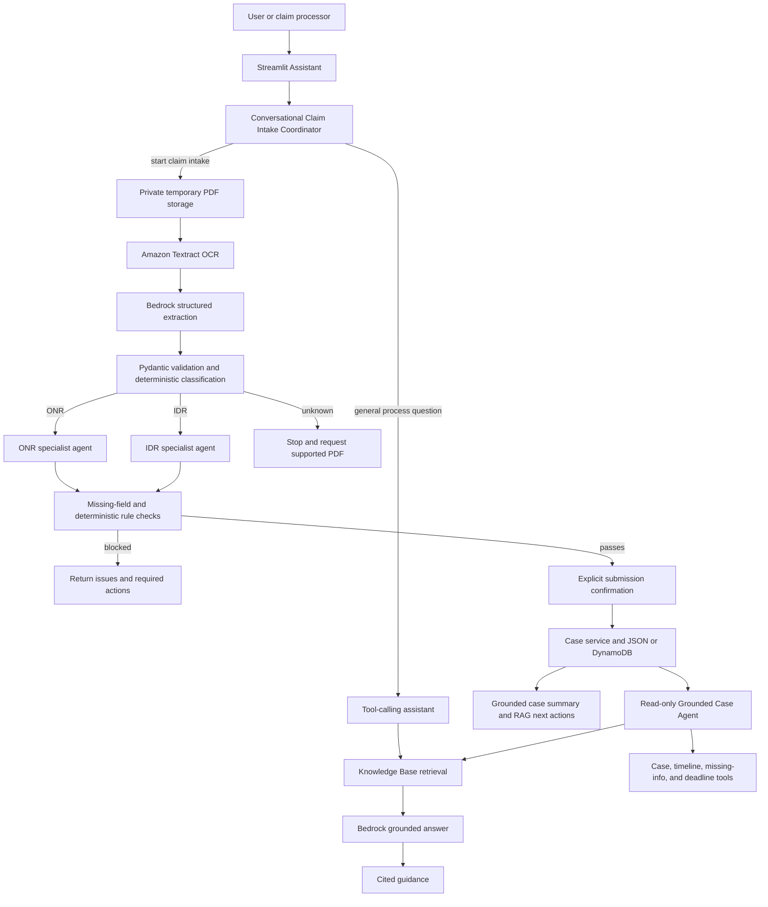

# ONR / IDR Case Intelligence Agent — 15-Minute Demo

## Demo objective

Show how the application reduces manual ONR/IDR claim intake work by:

1. understanding whether a user needs process guidance or wants to process a claim;
2. extracting structured claim data from a PDF;
3. delegating the document to an ONR or IDR specialist agent;
4. stopping unsupported, incomplete, duplicate, or rule-failing submissions early;
5. submitting a complete positive case only after explicit user confirmation; and
6. giving the claim-processing team a grounded summary and cited next actions.

The business message is: **automate intake and first-pass triage so claim processors can spend more time reviewing submission-ready cases and exceptions that require human judgment.**

## Scope statement

This is a synthetic demonstration with no PHI or PII. The application supports intake and triage; it does not make a final legal eligibility, coverage, payment, or medical-necessity decision. A case marked ready to submit has passed the implemented completeness and timing rules, but still remains subject to formal analyst review.

## 15-minute run of show

| Time | Segment | What to show | Main message |
| --- | --- | --- | --- |
| 0:00–1:00 | Opening | Title and one-sentence explanation | One assistant turns an unstructured claim PDF into a reviewable, grounded case. |
| 1:00–3:00 | Problem | Describe today's manual intake and triage work | Analysts lose time gathering fields, checking dates, finding guidance, and rejecting incomplete cases. |
| 3:00–5:00 | Architecture and AI skills | Use the architecture and capability flows below | AI is used for language and document understanding; deterministic code remains responsible for rules and dates. |
| 5:00–6:30 | RAG question | Ask a general ONR/IDR question in **Assistant** | Answers come from retrieved process guidance and include citations. |
| 6:30–11:30 | Positive claim walkthrough | Start intake, upload a prevalidated ONR PDF, review, and submit | The coordinator delegates to the ONR specialist; only a complete, rule-passing claim can be submitted. |
| 11:30–13:00 | Submitted result | Show case ID, summary, next actions, citations, then ask about the current claim | The result is useful to an analyst and traceable to case facts and process evidence. |
| 13:00–14:00 | Workload reduction | Explain the automatic stop conditions | The team receives fewer unsupported and incomplete cases in its active review queue. |
| 14:00–15:00 | Close | Recap outcomes and trust boundary | Faster intake, consistent triage, cited guidance, and human control at submission. |

## Opening script — 0:00–1:00

> The ONR/IDR Case Intelligence Agent is a grounded assistant for Open Negotiation and Independent Dispute Resolution claim workflows. It converts an uploaded claim document into structured, reviewable evidence, applies deterministic completeness and timing checks, delegates the case to the correct specialist workflow, and submits it only after the user confirms. The goal is not to replace claim analysts; it is to remove repetitive intake work so they can focus on valid cases and judgment-heavy exceptions.

## The problem we are solving — 1:00–3:00

Claim-processing teams often have to:

- determine whether a request belongs to ONR, IDR, or another process;
- read multi-page PDFs and re-enter claim, provider, service, amount, and date fields;
- identify missing information and unsupported documents;
- calculate business-day windows consistently;
- search process documents for the next action;
- recognize duplicate submissions; and
- prepare a case summary for the next reviewer.

This creates avoidable queue volume and inconsistent triage. Incomplete or obviously rule-failing cases consume the same initial attention as submission-ready cases.

The application moves those repeatable checks to the front of the workflow. It lets the human team concentrate on formal eligibility, ambiguous facts, exceptions, and final decisions.

## Architecture and AI skills — 3:00–5:00



### AI capabilities used

The first three capabilities determine what work to perform, understand the
uploaded document, and delegate it to the correct specialist:

```mermaid
flowchart TB
    subgraph TOOL["Tool-calling agent"]
        direction LR
        T1[User request] --> T2[Model selects a tool]
        T2 --> T3[Typed application tool]
        T3 --> T4[Grounded result]
    end

    subgraph DOC["Hybrid document intelligence"]
        direction LR
        D1[ONR or IDR PDF] --> D2[Textract OCR]
        D2 --> D3[Bedrock extraction]
        D3 --> D4[Schema and evidence validation]
    end

    subgraph A2A["Agent calling agents"]
        direction LR
        A1[Conversational coordinator] --> A2[Classified document]
        A2 --> A3[ONR or IDR specialist]
        A3 --> A4[Typed specialist review]
    end

    classDef ai fill:#dbeafe,stroke:#2563eb,color:#0f172a
    classDef evidence fill:#fef3c7,stroke:#d97706,color:#0f172a
    classDef control fill:#dcfce7,stroke:#15803d,color:#0f172a
    class T2,D3,A1,A3 ai
    class T1,D1,D2,A2 evidence
    class T3,T4,D4,A4 control
```



The next three capabilities keep answers traceable and reserve calculations
and workflow controls for deterministic code:

```mermaid
flowchart TB
    subgraph RAG["RAG"]
        direction LR
        R1[Process question] --> R2[Knowledge Base retrieval]
        R2 --> R3[Relevant passages]
        R3 --> R4[Answer with citations]
    end

    subgraph GS["Grounded summarization"]
        direction LR
        G1[Validated case or document facts] --> G2[Fact-limited prompt]
        G2 --> G3[Bedrock model]
        G3 --> G4[Evidence-bound summary]
    end

    subgraph DA["Deterministic automation"]
        direction LR
        C1[Authoritative fields] --> C2[Testable Python rules]
        C2 --> C3[Dates, missing fields, duplicates, and state]
        C3 --> C4[Block or proceed]
    end

    classDef ai fill:#dbeafe,stroke:#2563eb,color:#0f172a
    classDef evidence fill:#fef3c7,stroke:#d97706,color:#0f172a
    classDef control fill:#dcfce7,stroke:#15803d,color:#0f172a
    class R4,G2,G3,G4 ai
    class R1,R2,R3,G1,C1 evidence
    class C2,C3,C4 control
```



**Legend:** blue is model-driven work, gold is source evidence, and green is
typed or deterministic application control.

| Capability | How it is used | Guardrail |
| --- | --- | --- |
| Tool-calling agent | Selects current-date, holiday, case lookup, current-claim, Knowledge Base search, or claim-intake tools based on the user's request | Tools return application data; the model does not invent current case facts |
| Hybrid document intelligence | Textract reads layout and OCR evidence; Bedrock normalizes it into a strict ONR/IDR JSON contract | Pydantic validates the schema and deterministic text signals must confirm the document type |
| Agent calling agents | The conversational coordinator delegates a classified PDF to `onr_claim_agent` or `idr_claim_agent` through a typed specialist interface | A specialist rejects a document of the wrong type |
| RAG | Retrieves relevant ONR/IDR guidance from the Bedrock Knowledge Base before an answer is generated | Guidance includes source IDs and stays separate from authoritative case facts |
| Grounded summarization | Summarizes extracted documents and submitted cases | Prompts limit the model to supplied evidence; grounding checks protect case recommendations |
| Deterministic automation | Calculates Federal business-day windows, finds missing fields, identifies duplicates, and controls state transitions | Non-passing or non-evaluated rules block submission; idempotency prevents retry-created duplicates |

### How to explain “agent calling agents”

> The top-level conversational agent is the coordinator. After document classification, it calls one typed specialist: the ONR agent or the IDR agent. That specialist owns the workflow-specific rules, summary, and next actions. This is controlled delegation between application agents, not unrestricted autonomous agent-to-agent conversation.

## Live demo script

### 1. Demonstrate RAG — 5:00–6:30

Open **Assistant** and ask:

> What information is required before a Federal IDR case can proceed?

Point out:

- the assistant selected the process-knowledge search tool;
- the response is based on retrieved Knowledge Base content;
- source IDs or document locations are visible; and
- the response does not claim facts about a specific case.

Say:

> This is RAG: retrieve the relevant guidance first, then generate a concise answer from that evidence. Process guidance is cited and is never silently promoted into an authoritative case fact.

### 2. Submit a positive ONR claim — 6:30–11:30

In **Assistant**, enter:

> I want to process a claim.

The expected result is a request for an ONR or IDR PDF. Upload the prevalidated positive ONR demo PDF and select **Process claim document**.

Pause on the result and show:

- **Document type:** `ONR`;
- **Specialist agent:** `onr_claim_agent`;
- **Missing fields:** `0`;
- **Ready to submit:** `Yes`;
- every specialist rule has status `PASS`;
- the extracted values and page-level OCR evidence are available for review; and
- the generated summary is based on the extracted document.

Say:

> The coordinator identified an ONR document and delegated it to the ONR specialist. The model helped read and summarize the document, but deterministic code checked completeness, date ordering, and Federal business-day rules. A missing field, failed rule, or unevaluated rule would prevent this button from appearing.

Select **Submit claim**.

The expected result is:

- a success message containing a stable `CASE-*` ID;
- submission state `SUBMITTED`;
- a grounded case summary;
- cited post-submission next actions; and
- no second case if the same confirmation is retried with the same idempotency key.

### 3. Show the submitted case is usable — 11:30–13:00

Ask in the same Assistant conversation:

> Summarize the claim I just submitted and tell me the next action.

Point out that the current-claim tool returns the submitted case, specialist results, and deterministic rule evaluations. If time permits, copy the returned case ID into **Case lookup** and show the authoritative case record and timeline.

### Optional IDR positive case

Use a separate, fresh session and a prevalidated IDR PDF. The visible difference should be delegation to `idr_claim_agent`, which checks that the 30-business-day ONR period is complete and that IDR was initiated within the following four Federal business days.

Do not run both ONR and IDR live in the 15-minute version. Keep the IDR example as a backup or Q&A extension.

## How this reduces claim-team workload — 13:00–14:00

| Work arriving today | Automated first-pass behavior | What reaches the analyst |
| --- | --- | --- |
| Unrelated or unrecognized PDF | Classifies as `UNKNOWN` and stops | A request for a supported document, not a new case |
| Required field missing | Lists the exact missing fields and blocks submission | A corrected document or an explicit exception |
| Timing or sequence rule fails | Shows the rule, source, calculated deadline, recorded date, and result | A rule-passing case or a focused exception for review |
| Duplicate claim | Resolves a stable workflow-scoped claim identifier and returns the existing case | One case per ONR or IDR workflow instead of duplicate queue entries |
| Complete ONR/IDR intake | Produces structured data, summary, and next actions | A submission-ready case with evidence |
| Process question | Uses RAG and returns citations | Less manual searching through guidance |

The workload reduction comes from prioritization, not from removing human oversight:

```text
Incoming PDFs
    -> unsupported / incomplete / rule-failing: resolve before active review
    -> complete and rule-passing: submit to the analyst queue with evidence
    -> ambiguous eligibility or exceptions: escalate for human judgment
```

Useful operational measures for a future production pilot are intake handling time, percentage stopped before submission, missing-field rework rate, duplicate rate, analyst touches per submitted case, and time from upload to a review-ready record.

## Closing script — 14:00–15:00

> In one workflow we used tool calling to understand intent, Textract and Bedrock to structure a PDF, a coordinator-to-specialist agent handoff for ONR/IDR-specific processing, deterministic rules for dates and completeness, RAG for cited guidance, and explicit confirmation for submission. The result is not an AI making legal decisions. It is a controlled intake and triage system that gives claim processors cleaner cases, visible evidence, consistent calculations, and more time for the decisions that require expertise.

## Positive-case data contract

The positive ONR PDF used in the live demo must contain every common review field plus the ONR-specific fields:

| Field | Recommended synthetic value |
| --- | --- |
| Document type | `ONR` |
| Claim number | A new value for each rehearsal, such as `CLM-DEMO-ONR-001` |
| Provider name | `Synthetic Emergency Physicians` |
| Provider NPI | `1234567890` |
| Date of service | `2026-06-01` |
| CPT/HCPCS | `99285` |
| Billed amount | `8500.00` |
| Initial payment | `2100.00` |
| Initial payment or denial date | `2026-06-05` |
| QPA | `1950.00` |
| Requested amount | `6000.00` |
| Notice date | `2026-06-10` |
| Open negotiation start | `2026-06-10` |
| Open negotiation end | `2026-07-22` |
| Initiating party | `PROVIDER` |

These dates satisfy the current implemented checks and are complete before the demo date: service precedes negotiation, negotiation starts within 30 Federal business days of the initial payment or denial, and July 22 is exactly 30 Federal business days after June 10 under the application's calendar tool.

For a positive IDR example, reuse the June 10 start and July 22 end, set the IDR initiation date between July 23 and July 28, 2026, and include all IDR-specific fields: Federal IDR reference, initiating party, payer offer, and negotiation outcome.

## Pre-demo checklist

- Use synthetic data only; do not upload PHI or PII.
- Decide whether the demo will use the local assistant or the deployed AgentCore runtime, and do not switch modes during the presentation.
- Confirm the configured case repository, private document bucket, Textract access, Bedrock model, and Knowledge Base retrieval.
- Start a fresh browser session so intake state and the submission idempotency key are clean.
- Use a unique claim number unless duplicate detection is part of the story.
- Upload the exact positive PDF once and verify `Missing fields: 0`, `Ready to submit: Yes`, and all rules `PASS`.
- Confirm a general RAG answer returns at least one citation.
- Keep `CASE-1001` ready as the fallback case for lookup and case-chat questions.
- Rehearse the live path to finish by minute 13, leaving two minutes for impact and close.

### Important fixture warning

The current `demo/synthetic_onr_case_001.pdf` and `demo/synthetic_idr_case_001.pdf` are useful extraction samples, but they are not safe choices for the positive-submission walkthrough under the current rule implementation. They do not include an initial-payment/denial date, and their open-negotiation period ends on August 13, 2026; the application calculates August 26, 2026 as 30 Federal business days after the July 15 start. Regenerate a positive fixture with the values above and complete one end-to-end rehearsal before the presentation.

## Recovery plan

If document extraction or a cloud dependency is slow:

1. explain the expected extraction result using the positive-case contract above;
2. move to **Case lookup** with `CASE-1001`;
3. show status, missing information, timeline, documents, and deterministic deadline results;
4. open **Case chat** and ask: `What should the analyst do next, and what process guidance supports that action?`; and
5. close on the separation between authoritative case facts and cited Knowledge Base guidance.

Avoid troubleshooting live. State that the workflow depends on Textract, Bedrock, the Knowledge Base, and the configured repository, then continue with the fallback case.

## Likely questions

**Is the model deciding whether a claim is legally eligible?**
No. It extracts, routes, summarizes, and retrieves guidance. Implemented completeness and timing rules are deterministic, and formal eligibility remains a human or authoritative-system decision.

**Why use multiple agents?**
The coordinator owns conversation and workflow state, while ONR and IDR specialists own different rule sets and next actions. This keeps responsibilities explicit and testable.

**How do we reduce hallucinations?**
Case facts come from the repository or extracted document, calculations come from deterministic tools, retrieved guidance carries citations, structured outputs are validated, and unsupported factual tokens are rejected in grounded recommendations.

**How are duplicate submissions prevented?**
The workflow derives a stable case identifier from the claim number and uses an idempotency key for confirmation retries.

**Can this replace the claim-processing team?**
No. It reduces intake, re-keying, and first-pass triage work. Analysts still own eligibility, exceptions, and final decisions.
